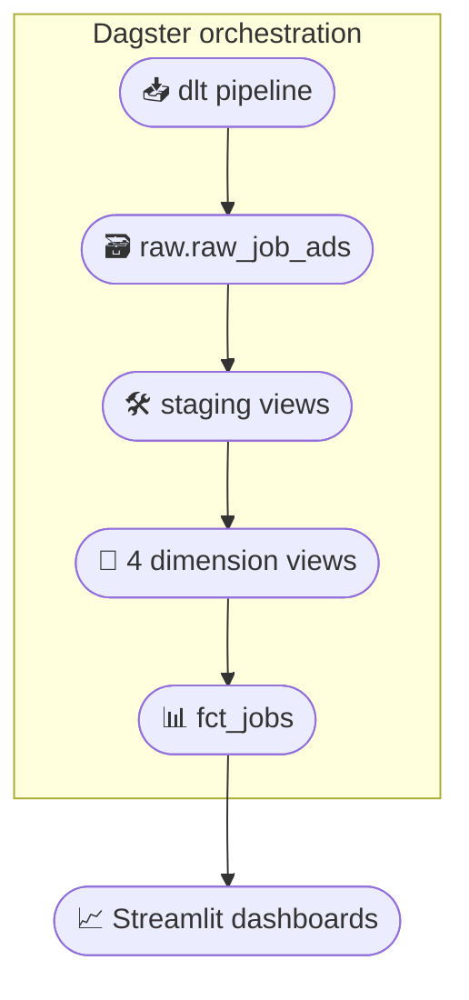
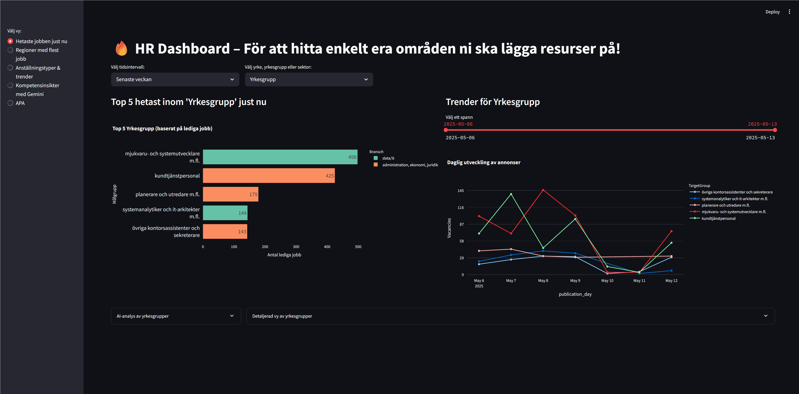
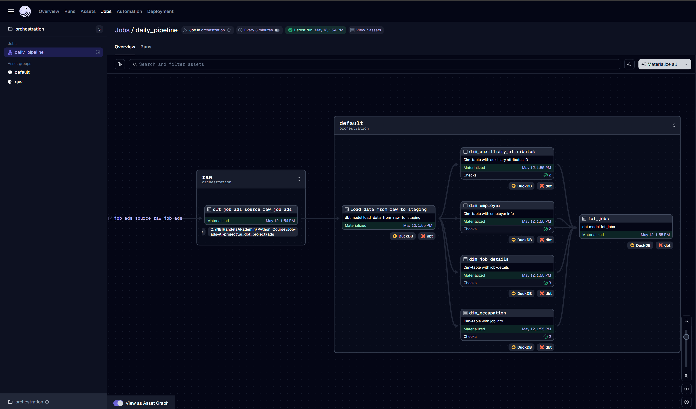

<h1 align="center">Job-ads-AI-project 🚀</h1>

<p align="center">
  
  
  
  
  
  
</p>

> End-to-end modern data stack for **Swedish job-ads analytics**  
> (dlt → DuckDB → dbt → Dagster → Streamlit + Gemini LLM)

---

## 🌟 Motivation & Goals

We collect and analyse Swedish job advertisements to answer questions like:

* **Which skills are most in-demand right now?**  
* **Are fully-remote positions increasing for Data-centric roles?** *(planned)*  

The insights help recruiters, job-seekers and labour-market analysts make data-driven decisions.

---

## 🌐 Architecture Overview



---

## 📊 Streamlit Demo
<p align="center">
  
</p>

## 🧠 Dagster Asset Graph
<p align="center">
  
</p>

---

## 📂 Repository Layout

```
JOB-ADS-AI-PROJECT/  
├── ai_dbt_project/     # dbt project (raw / staging / refined models)  
├── data_ingest_dlt/    # dlt pipeline (get_job_data.py + __init__.py)  
├── orchestration/      # Dagster code-location (assets, schedules)  
├── streamlit/          # Dashboards + Gemini integration  
├── requirements.txt  
└── README.md  
```

---

## ⚙️ Tech Stack

| Layer         | Tooling              | Highlight                                       |
|---------------|----------------------|-------------------------------------------------|
| Ingestion     | **dlt**              | incremental resource (`merge` on id)            |
| Storage       | **DuckDB**           | local file `ads.duckdb`                         |
| Modeling      | **dbt-Core**         | raw → staging → 4 dims + star-schema `fct_jobs` |
| Orchestration | **Dagster**          | software-defined assets + schedule              |
| Dashboards    | **Streamlit**        | interactive filters + LLM summaries             |
| LLM           | **Gemini 2.0 Pro**   | occupation insights                             |

---

## 🔑 Environment Variables
Copy the provided `.env.example` and rename it to `.env`.
Then fill in your real secrets (e.g. Gemini API key). Never commit your .env file!

Your .env.example contains:

```
# .env.example
GEMINI_API_KEY=your_gemini_key
JOBTECH_API_URL=https://jobsearch.api.jobtechdev.se/search     # public, no auth
DUCKDB_PATH=ads.duckdb
DAGSTER_HOME=C:\YOUR_PATH\job-ads-ai-project\.dagster_home
```

---

## 🖥️ Prerequisites

* Windows PowerShell  
* Git  
* Python 3.9 or later (tested on 3.10)  

---

## 🚀 Quick Start (PowerShell)

<details>
<summary>Expand Quick Start</summary>

### 1 – Clone repository  
```
git clone https://github.com/your-username/Job-ads-AI-project.git  
cd Job-ads-AI-project  
```

### 2 – Create & activate virtual env  
```
pip install uv  
uv venv  
.venv\Scripts\Activate  
```

### 3 – Install dependencies  
```
uv pip install -r requirements.txt  
```

### 4 – Run dlt ingestion  
```
cd data_ingest_dlt  
python get_job_data.py  
```

### 5 – Run dbt transformations  
```
cd ..\ai_dbt_project  
dbt deps  
dbt build  
```

### 6 – Launch Dagster UI  
```
cd ..\orchestration  
dagster dev  
```

### 7 – Start Streamlit dashboard  
```
cd ..\streamlit  
streamlit run app.py  
```
</details>

---

## ⚙️ Running Components Independently

| Component            | Command (PowerShell)                         | Purpose                    |
|----------------------|----------------------------------------------|----------------------------|
| Ingest only          | `python data_ingest_dlt\get_job_data.py`     | Pull latest ads            |
| dbt only             | `cd ai_dbt_project; dbt build`               | Refresh models             |
| Dagster asset (dev)  | Trigger manually in Dagster UI ▶             | Ad-hoc run                 |
| Streamlit only       | `streamlit run streamlit\app.py`             | Explore dashboard          |

---

## 🤖 Gemini LLM Usage Example

> **Occupation Insight – Software Engineer**  
> *Key skills:* Python, Java, Cloud. *Emerging trend:* AI/ML expertise. *Average experience:* 3-5 years.

LLM calls are executed inside **Streamlit** during dashboard rendering; results are cached to reduce quota usage.

---

## 🐞 Troubleshooting

| Issue                        | Hint / Fix                                               |
|------------------------------|----------------------------------------------------------|
| **Gemini quota errors**      | Verify `GEMINI_API_KEY`, wait 60 s, or upgrade tier      |
| **dbt “no profile found”**   | Ensure `~/.dbt/profiles.yml` points to `ads.duckdb`      |

---

## 🛣️ Roadmap (Planned)

* CI/CD with GitHub Actions  
* Materialised views in DuckDB for faster dashboards  
* Sentiment analysis of ad texts  
* Deploy public dashboard (AWS/Azure)  

---

## ✅ Assignment Progress

| Task                          | Status |
|-------------------------------|--------|
| Project & Git init            | ✔️ |
| dlt pipeline                  | ✔️ |
| Incremental handling          | ✔️ |
| dbt models                    | ✔️ |
| Streamlit dashboards          | ✔️ |
| dbt tests                     | ✔️ |
| Gemini API integration        | ✔️ |
| Dagster orchestration (bonus) | ✔️ |

---

## 👥 Contributors

| Name        | Role |
|-------------|------|
| Ludvig S.   | Ingestion, Modeling, Dashboard |
| Jonathan H. | Orchestration, LLM, Docs |

---

## 📝 License

Released under the **MIT License** – see ***LICENSE*** for full text.

